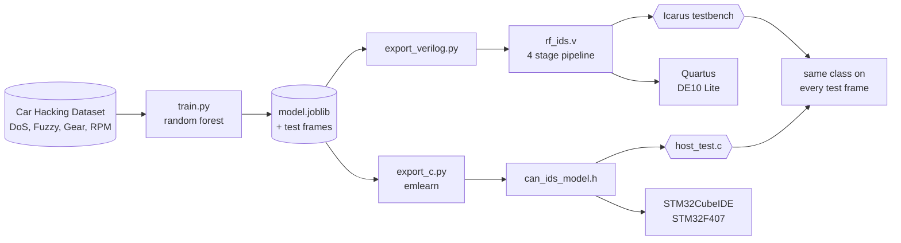

# CAN IDS/IPS: one random forest, three hardware builds

**FPGA based intrusion detection and prevention for CAN bus networks.**
EEN 527 Embedded System Design, ECCE Department, Faculty of Engineering.

A car's CAN bus has no authentication. Any node that reaches it through the
OBD port, the infotainment unit or a cellular modem can flood it, fuzz it or
spoof the engine speed. This project trains one random forest on real attack
traffic and runs that **exact same model** on three platforms, so the
comparison measures the hardware and nothing else:

| Build | Where the forest runs | Board |
|---|---|---|
| **FPGA only** | Pipelined Verilog, one frame per clock | Terasic DE10 Lite (Intel MAX 10 10M50DAF484C7G) |
| **MCU only** | emlearn C code | STM32F407 |
| **Combined** | FPGA taps the bus and decides, MCU logs and sets the bus off policy | Both |

No prior paper compares these three builds with the model held constant. The
[literature review](docs/literature_review.pdf) explains why that gap
matters.

---

## How it works



One trained model feeds both exporters. The same test frames run through the
Verilog simulation and the compiled C, and both must match Python's answer on
every frame before anything touches hardware.

### The FPGA classifier

`rf_ids.v` is generated from the model. Every tree becomes a block of
comparators, and all trees run in parallel:

| Stage | Work |
|---|---|
| 1 | Register the incoming frame (CAN ID, DLC, data bytes) |
| 2 | Every tree walks its comparators at once, each tree's class is registered |
| 3 | Count the votes per class |
| 4 | Output the class with the most votes (ties go to the lowest index) |

It takes a new frame every clock and answers 4 clocks later: **80 ns at the
DE10 Lite's 50 MHz**.

### The timing budget

To stop an attack, the detector must force an error frame before the frame
ends. Araujo Filho et al. (IEEE Access, 2021) give the time left after reading
the first N payload bytes as **19 + 8 × (8 − N) bit times**:

| Payload bytes read | Bit times left | Budget at 500 kbit/s |
|---|---|---|
| 5 | 43 | **86 µs** |
| 8 | 19 | 38 µs |

Train with `--payload-bytes 5` and the model never looks past byte 4, which
keeps the 86 µs budget. `python/latency.py` does this math for you from the
Quartus Fmax.

---

## Quick start

```bash
git clone --recursive https://github.com/charbel-j-estephan/CAN_IDS_IPS.git
cd CAN_IDS_IPS
pip install -r requirements.txt

# Check your tools on fake data (no download needed)
./run_pipeline.sh demo
```

You should see:

```
PASS: 2000 frames, all match Python. Latency 4 clocks.
PASS: 2000 frames, C model matches Python
```

Then with the real dataset in `data/car_hacking/`:

```bash
python python/train.py --data data/car_hacking --trees 100 --max-depth 10 --payload-bytes 5
python python/export_verilog.py      # hdl/generated/rf_ids.v + test vectors
python python/export_c.py            # mcu/generated/can_ids_model.h
python python/latency.py --fmax <Fmax from Quartus>
```

The **[build guide](docs/BUILD_GUIDE.md)** walks through every step: installing
the tools, getting the dataset, simulating, synthesizing in Quartus, reading
the timing report and timing the STM32.

---

## What's in the repo

```
python/
  dataset.py          Car Hacking Dataset loader, 10 integer features per frame
  train.py            trains the forest, reports accuracy, saves model + test set
  export_verilog.py   model -> pipelined Verilog + test vectors
  export_c.py         model -> emlearn C, with the threshold fix below
  latency.py          Fmax -> latency, checked against the CAN timing budget
  make_demo_data.py   fake data in the dataset's format, for tool checks
hdl/rf_ids_tb.v       Icarus Verilog testbench, checks every frame
quartus/              Quartus Prime Lite project for the DE10 Lite
mcu/host_test.c       runs the C model on your PC against the test vectors
mcu/stm32/            drop in STM32 code, times each call with the DWT counter
run_pipeline.sh       train, export, simulate and check in one command
docs/
  BUILD_GUIDE.md          step by step guide
  literature_review.pdf   the literature review
  literature_review.tex   its LaTeX source
  literature_review_fixes.md  what changed in the review and why
REFERENCES.md         every paper, dataset and tool, IEEE style
```

The three repos from the original plan are git submodules, kept for
reference: [IDS ML](https://github.com/Western-OC2-Lab/Intrusion-Detection-System-Using-Machine-Learning),
[FPGA_random_forest](https://github.com/johnbensnyder/FPGA_random_forest) and
[emlearn](https://github.com/emlearn/emlearn).

---

## Verified so far

| Check | Result |
|---|---|
| Verilog simulation vs Python, 100 trees | 2000 of 2000 frames match, 4 clock latency |
| C model vs Python, same frames | 2000 of 2000 match |
| Stress test, 8 trees with 450 tied votes | Verilog and C both match bit for bit |
| `--payload-bytes 5` | trees only read CAN ID, DLC and bytes 0 to 4 |
| Testbench with one wrong expected value | reports FAIL, so the check is real |
| Yosys synthesis, 100 trees, depth 10 | about 2,900 LUTs and 413 flip flops (the 10M50 has 49,760 LEs) |

Still to measure on hardware: Quartus Fmax and resource use on the real
dataset, STM32 worst case cycles, and the combined build.

---

## Engineering notes

Three things in the original plan did not work as expected, and the fixes are
part of this repo:

- **FPGA_random_forest could not classify.** Its converter averages the class 0
  value of each leaf, which acts like a regressor, and it crashes on scikit
  learn 1.2 and later. `export_verilog.py` replaces it with a voting classifier.
- **emlearn disagreed with scikit learn on some frames.** scikit learn splits on
  `x <= t`, emlearn writes `x < t`, and its int16 mode rounds 157.5 down to 157.
  On a test model this changed 156 of 2000 predictions. `export_c.py` moves every
  threshold to floor(t) + 0.5, which gives the same split under both rules.
- **GHDL only reads VHDL.** The project simulates with Icarus Verilog instead.

---

## Documents

- [Literature review](docs/literature_review.pdf): related work in rule based,
  machine learning and hardware detectors, and the gap this project fills
- [Build guide](docs/BUILD_GUIDE.md): every step from a fresh PC to timing numbers
- [References](REFERENCES.md): the 18 papers in the review plus the tools and datasets

## Team

- Anthony El Chakar
- Charbel Estephan
- Joe Geagea

Instructor: Dr. Abdallah Kassem

## Acknowledgments

The Car Hacking Dataset comes from the Hacking and Countermeasure Research Lab
(Seo, Song and Kim, PST 2018). The C export uses
[emlearn](https://github.com/emlearn/emlearn) by Jon Nordby. The timing budget
follows Araujo Filho et al., IEEE Access, 2021.
